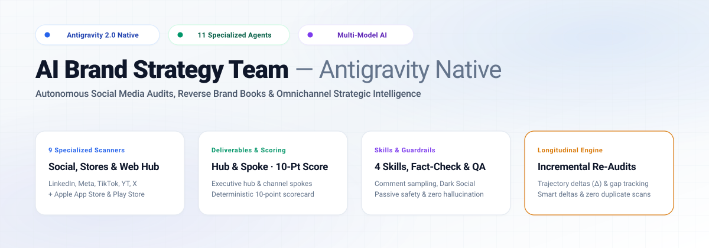
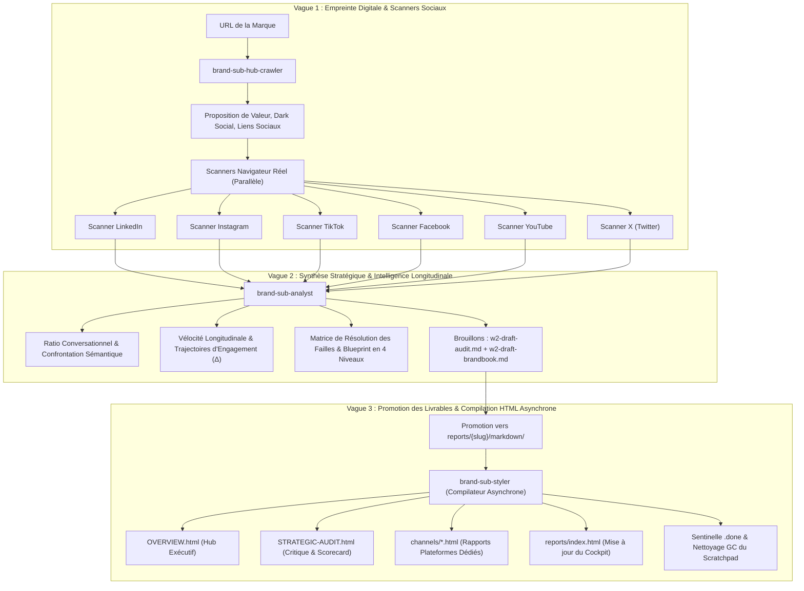

<p align="center">
  
</p>

# AI Brand Strategy Team — Antigravity Native

[](https://github.com/nicolasvd/brand-agents-agy/releases)
[](https://antigravity.google)
[](#-architecture-des-dossiers-hub--spoke)
[](#)
[-brightgreen.svg?style=flat-square)](#)
[](LICENSE)

> [🇬🇧 English](README.md) | 🇫🇷 **Français**

Framework autonome d'audit stratégique de marque et d'intelligence réseaux sociaux omnicanale, conçu nativement pour **Google Antigravity (Standalone / v2.0)** et orchestré par **Gemini 3**. À partir d'une simple URL de marque, il cartographie l'empreinte digitale, pilote des sessions de navigation réelles pour auditer les canaux sociaux sans blocage, échantillonne les verbatims authentiques, analyse les aperçus Dark Social et génère des livrables visuels de niveau exécutif adossés à des archives Markdown permanentes.

---

## 🚀 Démarrage Rapide

### Lancement en 1 Minute (Zéro Dépendance)

Aucun gestionnaire de paquets (`npm`, `pip`), environnement virtuel ou clé d'API externe n'est requis.

1. **Cloner ou Télécharger le Répertoire :**
   ```bash
   git clone https://github.com/nicolasvd/brand-agents-agy.git mon-audit-marque
   cd mon-audit-marque
   ```
2. **Ouvrir dans Google Antigravity :**
   Lancez Antigravity, cliquez sur **Open Folder**, puis sélectionnez `mon-audit-marque`.
3. **Lancer un Audit :**
   Dans le chat d'Antigravity, écrivez simplement :
   ```text
   Audit https://example.com
   ```
   *L'orchestrateur `brand-lead` explore la page d'accueil, cartographie les canaux sociaux, déploie les scanners en parallèle et synthétise l'audit stratégique.*
4. **Consulter les Livrables dans le Cockpit :**
   Ouvrez `reports/index.html` dans votre navigateur. Dès qu'un audit est finalisé, appuyez sur **Cmd + R** (ou **F5**) pour actualiser le portail et consulter vos rapports.

---

## 🏛️ Architecture Multi-Agents (Vagues 1, 2 et 3)



### Vague 1 : Exploration Factualisée (Zero-Knowledge)
- **`brand-sub-hub-crawler`** : Visite la page d'accueil avec hydratation SPA complète (React, Vue, Next.js). Capture la preuve visuelle au-dessus de la ligne de flottaison, extrait les métadonnées Open Graph (`og:*`, `twitter:*`) et teste la validité des liens sociaux sortants.
- **Scanners Navigateur Natifs** : Pilotent des sessions Chrome réelles pour contourner les protections anti-scraping sur LinkedIn, Instagram, TikTok, Facebook, YouTube et X.
  - Extraction stricte des abonnés (éradication totale des compteurs de followings/suivis).
  - Échantillonnage de 3 à 5 verbatims réels par publication majeure (`comment-sampling`).
  - Détection Fast-Exit (`NONE_OR_DISABLED`) si les commentaires sont absents ou désactivés.

### Vague 2 : Diagnostic Stratégique & Longitudinal
- **`brand-sub-analyst`** : Ingeste les données de la Vague 1 et les archives historiques.
  - Évalue la cohérence de la Tonalité (ToV) et calcule le Ratio Conversationnel ($\frac{\text{Commentaires}}{\text{Réactions}}$).
  - Applique le plafonnement à 6.5/10 de la Tonalité si des plaintes clients ou des frictions SAV restent sans réponse.
  - Suit l'évolution des failles entre audits (`🟢 RESOLVED`, `🟡 IN_PROGRESS`, `🔴 PERSISTENT`).
  - Rédige un plan d'action standardisé en 4 niveaux pour chaque faille non résolue.

### Vague 3 : Promotion & Compilation HTML Découplée
- **`brand-sub-styler`** : Compilateur HTML hors-ligne, déterministe. Lit directement depuis les archives permanentes `reports/{slug}/markdown/` et compile des interfaces soignées avec design tokens partagés et liens bidirectionnels vers les sources Markdown. Bootstrappe automatiquement `reports/index.html` lors du premier audit.

---

## 🔄 Protocole de Ré-Audit Incrémental

Lors du ré-audit d'une marque déjà analysée :
1. **Détection d'Archive :** `brand-lead` détecte la présence de `reports/{slug}/markdown/REVERSE-BRAND-BOOK.md` et active automatiquement `AUDIT_MODE = INCREMENTAL_UPDATE`.
2. **Bypass des Posts Épinglés & Arrêt $K=2$ :** Les scanners inspectent les publications récentes, ignorent les posts épinglés sans incrémenter le compteur, et stoppent immédiatement le défilement dès que $K=2$ publications consécutives non épinglées sont déjà archivées.
3. **Deltas de Trajectoire d'Engagement ($\Delta$) :** Les publications majeures de la baseline sont réévaluées pour mesurer l'accélération virale ($\Delta$ réactions, $\Delta$ commentaires).
4. **Économie de Captures d'Écran :** Réutilisation des bannières et avatars existants si l'identité visuelle n'a pas changé. Zéro capture superflue.

---

## 📁 Architecture des Dossiers Hub & Spoke

Tous les livrables respectent une arborescence hermétique et modulaire :

```text
reports/
├── index.html                               # Cockpit Global & Répertoire des Marques
├── .gitkeep                                 # Maintient le dossier dans Git (vierge)
└── {slug}/                                  # Dossier Marque (ex: ag-be)
    ├── OVERVIEW.html                        # Hub Central : Reverse Brand Book Exécutif
    ├── STRATEGIC-AUDIT.html                 # Spoke : Critique Stratégique & Progression Scorecard
    ├── channels/                            # Spokes Plateformes (Rapports détaillés)
    │   ├── linkedin.html
    │   ├── instagram.html
    │   ├── tiktok.html
    │   ├── facebook.html
    │   ├── youtube.html
    │   └── x.html
    ├── assets/                              # Captures d'Écran Permanentes & Stylesheet
    │   ├── css/
    │   │   └── design-tokens.css
    │   ├── screenshot-hub-20260930.png
    │   └── ...
    └── markdown/                            # Source de Vérité IA (Archives Permanentes)
        ├── REVERSE-BRAND-BOOK.md
        ├── STRATEGIC-AUDIT.md
        └── channels/
            ├── linkedin.md
            └── ...
```

---

## 🎯 Barème Déterministe sur 10 Points

Toutes les évaluations utilisent l'échelle standardisée sur 10 points (interdiction absolue des lettres de notation américaines) :

$$\text{Score Global de Cohérence (/10)} = \frac{\text{P1 (ToV)} + \text{P2 (Dark Social)} + \text{P3 (Vélocité)} + \text{P4 (Conversion)}}{4}$$

- **Pilier 1 : Tonalité Réelle & Réception Communautaire (0–10) :** Cohérence des discours, ratio conversationnel (alerte si $< 0.5\%$), détection des débordements SAV (plafonné à 6.5/10 si non traité).
- **Pilier 2 : Cohérence Omnicanale & Dark Social (0–10) :** Unité graphique, complétude Open Graph, simulation de partage privé (`RESOLVED` ou `FAILED`).
- **Pilier 3 : Vélocité de Publication & Cadence (0–10) :** Fréquence d'émission, mix de formats (% Reels/Shorts), persistance temporelle.
- **Pilier 4 : Conversion & Récit Produit (0–10) :** Optimisation des liens en bio, clarté des appels à l'action, rigueur épistémique paid vs organic (`ad_badge_present`).

### Échelle Qualitative
- **8.0 – 10.0 / 10 :** *Excellence & Forte Cohérence* (`.score-high`)
- **6.0 – 7.9 / 10 :** *Cohérence Modérée en Consolidation* (`.score-medium`)
- **< 6.0 / 10 :** *Désalignement Critique* (`.score-low`)

---

## 🛡️ Sécurité Passive & Rigueur Épistémique

1. **Posture 100% Lecture Seule :** Les scanners explorent les plateformes en consultation passive. Aucune publication, aucun message, aucun envoi de formulaire, aucune modification externe.
2. **Rigueur Épistémique (Paid vs Organic) :** Zéro affirmation de campagnes publicitaires sans badge DOM natif (`ad_badge_present: true`). Toute anomalie de volume sans badge est qualifiée au conditionnel de *portée amplifiée estimée* avec mention méthodologique obligatoire.
3. **Hygiène des Chemins Locaux :** Aucun chemin absolu fuitant dans les livrables (`file:///Users/...`, `/var/folders/...`). Tous les liens et images utilisent des chemins relatifs propres au projet.

---

## 📄 Licence

Ce projet est distribué sous licence [MIT](LICENSE).
