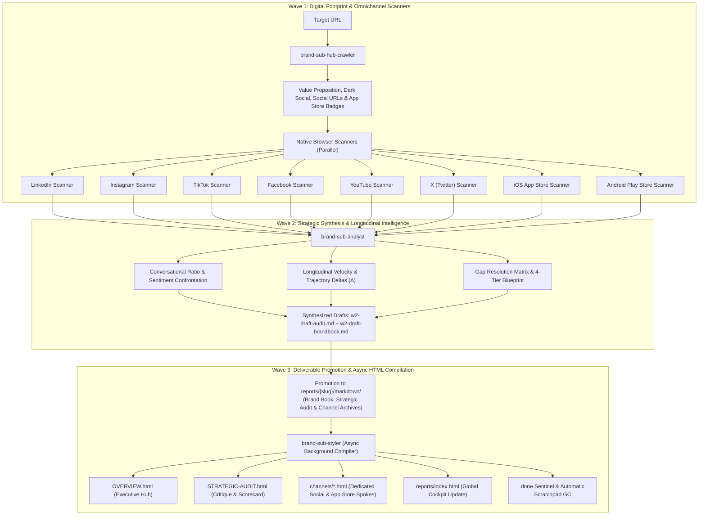

<p align="center">
  
</p>

# AI Brand Strategy Team — Antigravity Native

[](https://github.com/nicolasvd/brand-agents-agy/releases)
[](https://antigravity.google)
[](#-hub--spoke-architecture)
[](#)
[-brightgreen.svg?style=flat-square)](#)
[](LICENSE)

> 🇬🇧 **English** | [🇫🇷 Français](README.fr.md)

Autonomous Brand Strategy and Omnichannel Social Media Intelligence framework engineered natively for **Google Antigravity (Standalone / v2.0)** and powered by **Multi-Model AI**. Starting from a single company URL, it explores the brand's digital footprint, crawls active social channels via human-simulated browser sessions, extracts authentic user verbatims, audits Dark Social previews, and delivers agency-grade visual reports alongside permanent Markdown archives.

---

## 🚀 Quickstart

### 1-Minute Launch (Zero Dependencies)

No package managers (`npm`, `pip`), runtime setups, or environment variables required.

1. **Clone or Download Workspace:**
   ```bash
   git clone https://github.com/nicolasvd/brand-agents-agy.git my-brand-audit
   cd my-brand-audit
   ```
2. **Open in Google Antigravity:**
   Open Google Antigravity, click **Open Folder**, and select `my-brand-audit`.
3. **Launch an Audit:**
   In the Antigravity chat, run:
   ```text
   Audit https://example.com
   ```
   *The `brand-lead` orchestrator crawls the homepage, maps social channels, deploys parallel browser scanners, and synthesizes the strategic audit.*
4. **Inspect Deliverables in the Cockpit:**
   Open `reports/index.html` in your browser. Whenever an audit completes, hit **Cmd + R** (or **F5**) to refresh and view your reports.

---

## 🏛️ Multi-Agent Architecture (Waves 1, 2, and 3)



### Wave 1: The Zero-Knowledge Footprint
- **`brand-sub-hub-crawler`**: Navigates to the brand homepage with full SPA hydration. Captures above-the-fold visual proof, extracts Dark Social Open Graph metadata (`og:*`, `twitter:*`), scans `<head>` for iOS Smart App Banners (`<meta name="apple-itunes-app">`), and maps all outbound social channels and mobile app store links.
- **Parallel Browser Scanners**: Drive human-simulated Chrome browser sessions to bypass anti-scraping walls on LinkedIn, Instagram, TikTok, Facebook, YouTube, X, Apple App Store, and Google Play Store.
  - Social scanners extract verified community metrics (strictly no vanity following) and sample 3 to 5 authentic qualitative verbatims (`comment-sampling`).
  - Mobile store scanners audit application rating (/5.0), rating volume, public download tiers (`1M+`, `500k+`), version release notes, changelog cadence, and user reviews with official developer replies.
  - Fast-exit sentinel (`NONE_OR_DISABLED`, `NONE_OR_EMPTY`) when comments or reviews are absent.

### Wave 2: Strategic & Longitudinal Evaluation
- **`brand-sub-analyst`**: Ingests Wave 1 findings and historical Markdown archives.
  - Evaluates Tone of Voice (ToV) coherence and calculates Conversational Ratio ($\frac{\text{Comments}}{\text{Reactions}}$).
  - Enforces Tone of Voice capping (max 6.5/10) if customer support complaints appear in comments, or if flagship mobile app rating $< 3.0 / 5.0$, or developer reply rate to critical reviews $< 20\%$.
  - Awards commercial conversion bonus (+0.5 pt) for high-performing mobile apps ($\ge 4.4 / 5.0$ and $\ge 1\text{M}+$ downloads).
  - Tracks prior gaps across audits (`🟢 RESOLVED`, `🟡 IN_PROGRESS`, `🔴 PERSISTENT`).
  - Writes a comprehensive 4-Tier Action Blueprint for every unaddressed gap.

### Wave 3: Deliverable Promotion & Asynchronous HTML Compilation
- **`brand-sub-styler`**: Deterministic, offline compiler. Reads directly from permanent Markdown archives in `reports/{slug}/markdown/` and builds agency-grade HTML views with shared design tokens and bi-directional source linking. Generates platform spokes for all detected social networks and mobile stores (`channels/appstore.html`, `channels/playstore.html`), embedding changelog boxes and developer reply cards. Automatically bootstraps `reports/index.html` on first run.

---

## 🔄 Incremental Re-Audit Protocol

When auditing a brand that was audited previously:
1. **Archive Detection:** `brand-lead` automatically detects existing archives in `reports/{slug}/markdown/REVERSE-BRAND-BOOK.md` and activates `AUDIT_MODE = INCREMENTAL_UPDATE`.
2. **Pinned Post Bypass & $K=2$ Stop Counter:** Social scanners inspect recent feed posts, bypass pinned posts without advancing the counter, and halt scrolling as soon as $K=2$ consecutive unpinned posts are recognized as already archived.
3. **Store Version & Rating Tracking:** Mobile scanners compare version string with `{known_version}` and compute $\Delta$ rating count and $\Delta$ score.
4. **Engagement Trajectory Deltas ($\Delta$):** Top-performing historical posts are re-checked for freshness, logging delta velocity ($\Delta$ reactions, $\Delta$ comments).
5. **Screenshot Restraint:** Existing header screenshots and archived post media are reused. Zero redundant screenshot captures.

---

## 📁 Hub & Spoke Architecture

All reports and visual artifacts follow a clean, hermetic directory structure:

```text
reports/
├── index.html                               # Global Cockpit & Audited Brands Directory
├── .gitkeep                                 # Preserves directory in Git
└── {slug}/                                  # Brand Dossier (e.g., ag-be)
    ├── OVERVIEW.html                        # Central Hub: Executive Reverse Brand Book
    ├── STRATEGIC-AUDIT.html                 # Spoke: In-Depth Strategic Critique & Scorecard
    ├── channels/                            # Platform Spokes (Dedicated channel reports)
    │   ├── linkedin.html
    │   ├── instagram.html
    │   ├── tiktok.html
    │   ├── facebook.html
    │   ├── youtube.html
    │   ├── x.html
    │   ├── appstore.html                    # Mobile Spoke: Apple App Store
    │   └── playstore.html                   # Mobile Spoke: Google Play Store
    ├── assets/                              # Permanent Screenshots & CSS
    │   ├── css/
    │   │   └── design-tokens.css
    │   ├── screenshot-hub-20260930.png
    │   └── ...
    └── markdown/                            # AI Source of Truth (Permanent Archives)
        ├── REVERSE-BRAND-BOOK.md
        ├── STRATEGIC-AUDIT.md
        └── channels/
            ├── linkedin.md
            ├── appstore.md
            ├── playstore.md
            └── ...
```

---

## 🎯 Deterministic 10-Point Scorecard

All appraisals use the standardized 10-point scale (US letter grades are strictly prohibited):

$$\text{Global Consistency Score (/10)} = \frac{\text{P1 (ToV)} + \text{P2 (Dark Social)} + \text{P3 (Velocity)} + \text{P4 (Conversion)}}{4}$$

- **Pillar 1: Tone of Voice & Community Reception (0–10):** Semantic alignment, conversational ratio ($< 0.5\%$ alert), customer support overflow detection. Capped at 6.5/10 if unresolved complaints exist, mobile app average rating $< 3.0 / 5.0$, or developer reply rate to critical reviews $< 20\%$.
- **Pillar 2: Omnichannel Consistency & Dark Social (0–10):** Visual identity cohesion, complete Open Graph tags, private sharing simulation (`RESOLVED` vs `FAILED`), store developer naming consistency.
- **Pillar 3: Publication Velocity & Cadence (0–10):** Publishing frequency, multi-format distribution (% Reels/Shorts), mobile release vitality (updated $< 45$ days: +0.5 bonus, $> 6$ months: penalty).
- **Pillar 4: Conversion & Product Narrative (0–10):** Bio link infrastructure, clear commercial CTA, mobile conversion bonus (+0.5 pt if app rating $\ge 4.4 / 5.0$ and $\ge 1\text{M}+$ downloads), paid vs organic epistemic rigor (`ad_badge_present`).

### Qualitative Scale
- **8.0 – 10.0 / 10:** *Excellence & Strong Cohesion* (`.score-high`)
- **6.0 – 7.9 / 10:** *Moderate Cohesion in Consolidation* (`.score-medium`)
- **< 6.0 / 10:** *Critical Misalignment* (`.score-low`)

---

## 🛡️ Passive Safety & Epistemic Rigor

1. **Read-Only External Posture:** Scanners navigate exclusively in read-only mode. Never post comments, fill forms, send messages, or mutate third-party accounts.
2. **Epistemic Rigor (Paid vs Organic):** Never assert advertising spend without direct DOM ad badges (`ad_badge_present: true`). Outsized virality is labeled conditionally as *estimated amplified reach* (*portée amplifiée estimée*) with a mandatory methodological caveat.
3. **Local Path Hygiene:** Zero absolute path leaks (`file:///Users/...`, `/var/folders/...`). All links and media use clean project-relative paths.

---

## 📄 License

This project is licensed under the [Apache License 2.0](LICENSE).
